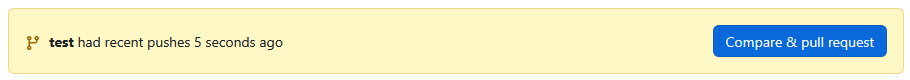

Voici la version détaillée avec les explications techniques complètes :

# Workflow de collaboration Trunk-Based (Détaillé)

## Convention des commits

### Tableau des types de commits conventionnels

| Type         | Description                                 | Exemple de message                              | Cas d'usage typique       |
| ------------ | ------------------------------------------- | ----------------------------------------------- | ------------------------- |
| **feat**     | Ajoute une nouvelle fonctionnalité          | `feat(api): ajout endpoint /users`              | Développement US          |
| **fix**      | Corrige un bug existant                     | `fix(auth): timeout session à 15min`            | Bug en production         |
| **chore**    | Modification de maintenance                 | `chore(deps): mise à jour SpringBoot 3.1.2`     | Mise à jour technique     |
| **docs**     | Modification documentation                  | `docs(api): ajout exemples OpenAPI`             | Amélioration doc          |
| **style**    | Changements cosmétiques                     | `style: formatage avec Prettier`                | Normes de code            |
| **refactor** | Restructuration sans changement fonctionnel | `refactor(service): découpage UserService`      | Amélioration architecture |
| **test**     | Ajout/modification tests                    | `test(unit): couverture UserService 90%`        | TDD/validation            |
| **perf**     | Amélioration performance                    | `perf(db): index sur champ email`               | Optimisation              |
| **typo**     | Changement mineurs                          | `typo(README) : Correction fautes orthographes` | Changements mineurs       |

**Structure complète** :

```
<type>(<scope>): <description>

<corps optionnel>

<footer optionnel>
```

## Fin du developpement de la branche

### Création de branche

```bash
git checkout -b feat/US-123-description main
```

-   `checkout -b` : Crée et bascule sur une nouvelle branche
-   `feat : ...` : Nommage selon convention
-   `main` : Branche source (garantit le sync initial)

### Cycle de développement

```bash
git add -p
```

| Option | Effet                        | Cas d'usage           |
| ------ | ---------------------------- | --------------------- |
| `-p`   | Mode interactif par hunk     | Commit partiel propre |
| `-u`   | Inclut les fichiers modifiés | Alternative rapide    |
| `-A`   | Ajoute tous les changements  | Pour petits fixes     |

```bash
git commit -m "feat(api): implémentation endpoint POST /users"
```

-   `-m` : Spécifie le message directement
-   Structure : Respect strict du conventionnal commits

### Synchronisation

```bash
git pull --rebase origin main
```

-   `--rebase` : Réécrit l'historique local sur main
-   `origin main` : Référence la branche distante
-   `--autostash` (optionnel) : Garde les modifs non commitées

### Push initial

```bash
git push -u origin feat/US-123-description
```

-   `-u` : Définit l'upstream branch (permet `git push` seul ensuite)
-   `origin` : Remote cible
-   Branche distante : Même nom que locale

## 3. Gestion avancée des PR

### Création de Pull Request

1.  Pour créer le pull request aller sur la page du projet sur github.com et séléctionner la branche correspondante.
2.  Quand la fonctionnalité est developpé cliquer sur `Compare and pull request` pour cérer la pull request.
    
3.  Compléter les divers champs en suivants les normes suivantes :

    -   Pour le titre basé vous sur les normes conventionnelles des commit avec cette syntaxe : `<type>: <user-story> - <description-courte>`

    Exemple :

    ````plaintext
    feat: US-123 - Implémentation service SMS
    fix: US-456 - Correction timeout API
    chore: US-789 - Mise à jour dépendances Spring

        ```
    ````

    -   Pour la description basé vous sur ce templete et complété-le

```markdown
## Objectif Principal

[Description concise de la finalité business/technique]

**User Story liée** : [Lien vers la US GitHub]

## Modifications Apportées

-   Liste des changements majeurs
-   Architecture modifiée
-   Dépendances ajoutées/supprimées

## **DoD** : **D**efinition **o**f **D**one

### Qualité

-   [ ] Les standards de code sont respectés.
-   [ ] Les tests nécessaires ont été exécutés.

### Diffusion

-   [ ] L'information nécessaire a été communiquée au reste de l'équipe.
-   [ ] Les radiateurs d'information correspondants ont été actualisés.
-   [ ] La documentation correspondante a été écrite ou actualisée.

### Révision

-   [ ] La qualité interne se maintient ou s'améliore.
-   [ ] Le Product Owner a vu une démonstration
-   [ ] Une pré-démonstration (démonstration à blanc) a été réalisée.
-   [ ] La démonstration correspondante a été préparée.

### Environnements

-   [ ] Le code impliqué est stocké dans un contrôleur de source.
-   [ ] Le produit complet est stocké dans un contrôleur de source.
```

## 4. Workflow complet

1. **Initialisation**

    ```bash
    git clone <repo-url> && cd project
    ```

    - Clone le dépôt et se place dans le répertoire

2. **Synchronisation quotidienne**

    ```bash
    git fetch --all --prune && git rebase origin/main
    ```

    - `--prune` : Nettoie les branches supprimées
    - `rebase` : Maintient un historique linéaire

3. **Résolution de conflits**

    ```bash
    git mergetool --tool=vimdiff
    ```

    - Ouvre un outil de merge pour résolution
    - `--tool` : Spécifie l'éditeur (ex: vscode, meld)

4. **Nettoyage local**
    ```bash
    git branch --merged | grep -v "main" | xargs git branch -d
    ```
    - Supprime les branches mergées localement
    - `-d` : Suppression sûre (erreur si non mergé)
